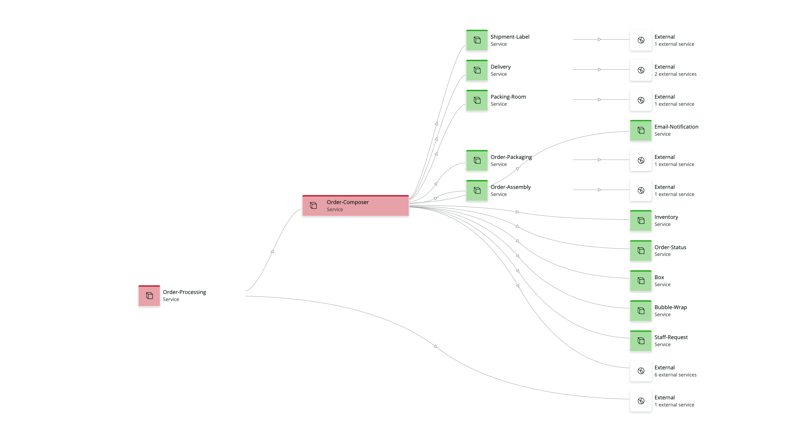

# Order Processing 

The Demotron V2 account contains a fairly detailed microservice tier dedicated to a fictional Order Processing flow.

## Stages

### Order Management

#### APM Sources
 - [Order-Processing](https://onenr.io/0PLRE0Xqowa)
 - [Order-Composer](https://onenr.io/09MR2Jon0RY)
 - [Order-Status](https://onenr.io/08dQee8YoQe)
 - [Billing-Service](https://onenr.io/0JBQrXZ5rRZ)
 - [Inventory](https://onenr.io/0PoR8JDBXQG)

#### Infra Sources (Examples)

- Order Composer Pod Wait: `FROM K8sContainerSample select uniqueCount(podName) where status = 'Waiting' and podName like 'order-composer-%'`

#### Packaging

#### APM Sources

- [Order-Packaging](https://onenr.io/0LkjnD1N0wo)
- [Order-Assembly](https://onenr.io/0a7j9J4EAQO)
- [Box](https://onenr.io/0eqwyG7kAjn)
- [Bubble-Wrap](https://onenr.io/0LkjnDbx6wo)
- [Packing-Room](https://onenr.io/0bEjO0x58Q6)
- [Inventory](https://onenr.io/0PoR8JDBXQG)
- [Inventory-Service](https://onenr.io/01qwL0zNrw5)

#### Browser Sources
- Home Page: `FROM BrowserInteraction select percentile(duration, 95) where appName = 'WebPortal' where browserInteractionName = 'webportal.telco.nrdemo.com:80/index.html'`
- Browse Product: `FROM BrowserInteraction select percentile(duration, 95) where appName = 'WebPortal' where browserInteractionName = 'webportal.telco.nrdemo.com:80/browse/phones/*'`
- Cart Activity: `FROM BrowserInteraction select percentile(duration, 95) where appName = 'WebPortal' where browserInteractionName = 'webportal.telco.nrdemo.com:80/shoppingcart'`

#### Database Sources
- `SELECT average(provider.readLatency.Average) from DatastoreSample where displayName = 'planservicedbtelcoprod'`

#### Infra Sources (Examples)

- Inventory Pod Wait: `FROM K8sContainerSample select uniqueCount(podName) where status = 'Waiting' and podName like  'inventory%'`

### Shipping

#### APM Sources

- [Shipping-Service](https://onenr.io/0eqwyG76ejn)
- [Shipment-Label](https://onenr.io/01OwvGx6WRv)
- [Delivery](https://onenr.io/0znQxGq6JjV)

#### Infra Sources (Examples)

- Shipping Pod Wait: `FROM K8sContainerSample select uniqueCount(podName) where status = 'Waiting' and podName like  'shipping%'`

###  Notification

#### APM Sources

- [Email-Notification](https://onenr.io/0LkjnD19Jwo)
- [SMS-Notification](https://onenr.io/08dQee89DQe)

#### Infra Sources (Examples)

- Notification Pod Wait: `FROM K8sContainerSample select uniqueCount(podName) where status = 'Waiting' and podName like  '%-notification-%'`

